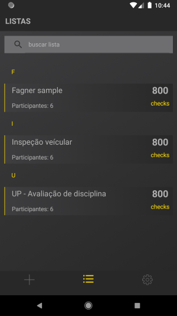

# Findo

### Universidade Positivo ###

**Disciplina** Trabalho de conclusão de curso.

**Curso** Pôs graduação dispositivo moveis e computação na nuvem.

**Professor Orientador:** @willbuildapps

### Breve descrição:###
   Solução para coleta de dados, permitindo apontamento de campo de diversos tipos de dados, grupos de usuários e controle de privacidade.
 
### Motivo: ###
   Em acompanhamento de varias empresas pude perceber que a grande maioria realizam algum tipo de apontamento de dados, vejo hoje uma oportunidade de poder coletar informações para qualquer area em um aplicativo, e fornecer os dados de maneira analitica atraves de um BI, para assim gerar valor de negócio. As listagens possuiram categorias gostaria futuramente de poder colaborar com a sociedade atraves das informações disponiveis mas será um passo a ser pensado futuramente.
 

## APP
- Arquitetura: Domain Driven Design
- Integração Continua com APP Center

***FindoAPP***
 Projeto responsavel por controlar navegação da tela e bindings de tela com MVVM

- Dependencias
  - Xamarin.Forms - recursos para plataforma hibrida
  - Prism.DryIoc.Forms - Gerenciamento de injeção de dependencia
  
***FindoAPP.Android***
 Projeto responsavel pela interface nativa android
 
***FindoAPP.iOS***
 Projeto responsavel pela interface nativa IOS

***FindoAPP.Service***
 Projeto responsavel por prover os dados a interface e controlar acessos a API's.

- Dependencias
  - Refit - Automatização de chamadas REST.
  
***FindoAPP.Domain***
 Projeto responsavel pelas entidades que representam o negocio, interfaces que devem ser nescessarias para o funcionamento da aplicação e configurações do aplicativo atraves do arquivo AppSettings.

***FindoAPP.Infra.SQLite***
 Projeto responsavel por salvar os dados localmente usando banco de dados relacional.

### Screenshot 

## API

- Arquitetura: MicroServiços e DDD

***Findo.Framework***
 Projeto responsavel por prover classes Genericas de controller, Services, Repository e utilidades para as api
 
 
***Findo.Api.User***
 Projeto responsavel por autenticação de usuarios e JWT
 
 
***Findo.Api***
 Projeto responsavel por controlar as request de listagens usando segurança JWT, autenticada pelo micro serviços de usuarios.
 
 
